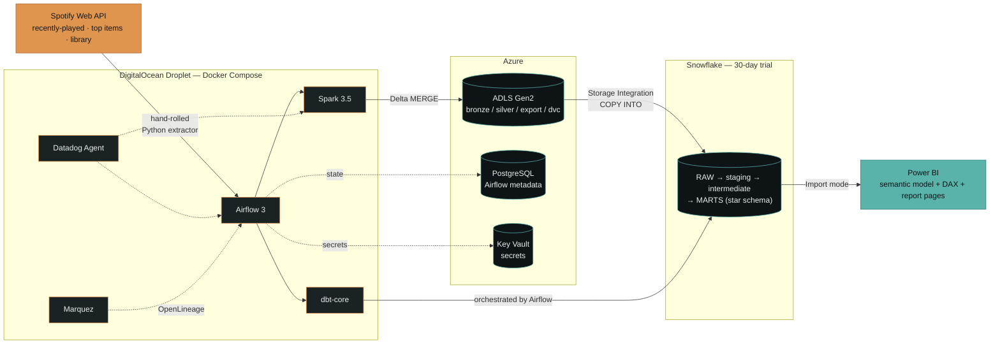

# Spotify Personal Listening Lakehouse — End-to-End Portfolio Build Plan

**Project codename:** `sonic-lakehouse`
**One-line pitch:** A production-patterned, multi-cloud ELT platform that incrementally captures my personal Spotify listening history, lands it in an Azure data lake, transforms it with Spark, models it into a Kimball star schema in Snowflake via dbt, orchestrates it with Airflow on DigitalOcean, and serves it through Power BI — with IaC, CI/CD, data + pipeline versioning, and full observability.

**Realistic effort:** 11–13 weeks at 10–15 hrs/week solo. Every phase has an independent demo artifact so you can stop, ship, and put it on a résumé at any boundary.

---

## 0. Executive Design Decisions (the calls I'm making for you)

| Decision point | Call | One-line justification |
|---|---|---|
| Airbyte / Fivetran | **Not used** | One well-understood REST API with OAuth refresh, a 50-item cursor cap, and custom dedupe semantics. A managed connector adds a service to run and *hides* the exact logic an interviewer wants to see. Documented as an explicit ADR, not an omission. |
| Data version control | **DVC** (Azure Blob remote) | Git-native: `dvc.lock` is committed, so a git SHA pins an exact dataset hash. lakeFS needs a server + KV store on a droplet already running Airflow, Spark, and Postgres — wrong ops/value ratio at 5k rows/month. lakeFS named in ADR as the real-scale answer. |
| Data quality | **dbt tests + `dbt-expectations` + `elementary-data`** as primary; **Pandera** at the Spark boundary | Warehouse-side quality belongs where the models live. Great Expectations needs its own context/store/docs stack and duplicates dbt's surface. Pandera covers bronze→silver where dbt can't reach. |
| Observability | **Datadog** (host/container/Airflow/custom metrics + logs + monitors) + **Sentry** (exceptions) + **OpenLineage → Marquez** (lineage) + **Elementary** (data-quality history) | Datadog Pro is free for 2 years via the pack and is the stack you'll actually meet in industry. Sentry gives stack-trace grouping Datadog logs don't. |
| Lake table format | **Delta Lake** for silver, Parquet export prefix for Snowflake | `MERGE INTO` gives idempotent dedupe on `played_at` — the actual reason, not fashion. Iceberg named as the "what I'd evaluate today" alternative. |
| Warehouse loading | Snowflake **Storage Integration + External Stage + `COPY INTO`** | Deterministic, batch-aligned, Snowflake tracks loaded files for 64 days (free idempotency). Snowpipe + Event Grid documented as the streaming alternative; optional stretch. |
| Airflow version | **Airflow 3.x** | Native DAG versioning in the UI, Assets (data-aware scheduling), and a first-class OpenLineage provider — all three are directly load-bearing for your requirements. |
| Python / Spark | **Python 3.11 + Spark 3.5.x + delta-spark 3.2** | Widest provider/connector compatibility. Develop Spark in **WSL2 or the Docker dev container**, never native Windows (winutils.exe pain is not a skill demonstration). |
| Task runner | **Taskfile (`Task`)**, not Make | Cross-platform, works in PowerShell natively. |
| Package manager | **`uv`** | Fast, lockfile-based, single tool for venv + deps. |

---

## 1. Architecture Overview

### At a glance



### Full component map

```
┌──────────────────────────────────────────────────────────────────────────────┐
│                          SPOTIFY WEB API (source)                            │
│  Authorization Code flow (personal): /me/player/recently-played (50 cap),     │
│    /me/top/{tracks,artists}, /me/tracks, /me/playlists                       │
│  Client Credentials flow (catalog):  /artists?ids=, /albums?ids=, /tracks?ids=│
└───────────────────────────────┬──────────────────────────────────────────────┘
                                │  hand-rolled Python extractor (httpx + tenacity)
                                │  cursor = max(played_at); 429-aware; Pydantic-validated
                                ▼
┌──────────────────────────────────────────────────────────────────────────────┐
│  DIGITALOCEAN DROPLET  (s-4vcpu-8gb, Docker Compose, private VPC, CF Tunnel)  │
│  ┌────────────┐  ┌────────────┐  ┌──────────────┐  ┌──────────┐ ┌──────────┐ │
│  │ Airflow 3  │  │ Spark 3.5  │  │  dbt-core    │  │ Datadog  │ │ Marquez  │ │
│  │ api+sched  │  │ master +   │  │  (Cosmos-    │  │  Agent   │ │ (Open-   │ │
│  │ +triggerer │  │ 1 worker   │  │  rendered)   │  │          │ │ Lineage) │ │
│  └─────┬──────┘  └─────┬──────┘  └──────┬───────┘  └────┬─────┘ └────┬─────┘ │
│        │ metadata DB ──┼────────────────┼───────────────┼────────────┘       │
└────────┼───────────────┼────────────────┼───────────────┼────────────────────┘
         │               │                │               │
         ▼               ▼                │               ▼
┌─────────────────┐  ┌──────────────────────────────┐  ┌───────────────────────┐
│ AZURE (Sub A =  │  │      ADLS Gen2 (HNS on)      │  │  DATADOG SaaS         │
│ prod)           │  │  bronze/  raw JSONL, hive-   │  │  metrics/logs/monitors│
│ • PostgreSQL    │  │           partitioned by     │  │  SENTRY  exceptions   │
│   Flexible B1ms │  │           ingest_date/hour   │  └───────────────────────┘
│   (Airflow meta)│  │  silver/  Delta tables       │
│ • Key Vault     │  │  export/  Parquet for COPY   │
│   (Spotify RT,  │  │  dvc/     DVC content store  │
│    SF keypair)  │  │  artifacts/ dbt manifests    │
└─────────────────┘  └──────────────┬───────────────┘
                                    │ Storage Integration + External Stage
                                    ▼
┌──────────────────────────────────────────────────────────────────────────────┐
│  SNOWFLAKE  (30-day trial → on-demand)                                       │
│  RAW db  ──COPY INTO──►  dbt: staging → intermediate → MARTS (star schema)   │
│  WH_LOAD_XS / WH_TRANSFORM_XS / WH_BI_XS, auto_suspend=60, resource monitors │
└───────────────────────────────┬──────────────────────────────────────────────┘
                                │ Snowflake connector, Import mode
                                ▼
┌──────────────────────────────────────────────────────────────────────────────┐
│  POWER BI Desktop (Windows) → Power BI Service (My Workspace / A3 Pro)        │
│  Star-schema semantic model, DAX measures, RLS demo, incremental refresh      │
└──────────────────────────────────────────────────────────────────────────────┘

Cross-cutting:
  GitHub (monorepo, Actions CI/CD, GHCR images, Pages for dbt docs + Elementary)
  Terraform Cloud (remote state, 5 workspaces, speculative plans on PR)
  DVC (data versions pinned by git commit)  ·  Git tags → immutable image tags
  Cloudflare (free) — DNS for Namecheap domain + Tunnel/Access for Airflow UI
```

**Where each cloud sits — and why:**

| Service | Provider | Role | Why here |
|---|---|---|---|
| Airflow, Spark, dbt runtime, Datadog agent, Marquez | **DigitalOcean Droplet** | All compute | Your decision, and correct: flat predictable pricing, root access, Docker Compose is the right operational weight for one person. |
| ADLS Gen2 | **Azure** | Bronze/silver/export/DVC-remote data lake | Hierarchical namespace gives real directory semantics for Spark; native Snowflake Storage Integration support; pennies at this volume. |
| Key Vault | **Azure** | Spotify refresh token, Snowflake RSA private key, DO/TFC tokens | Airflow's `AzureKeyVaultBackend` secrets backend means **zero secrets in the Airflow DB or on disk** — a genuinely production-grade detail. |
| PostgreSQL Flexible Server (B1ms) | **Azure** | Airflow metadata DB | Makes the droplet **stateless and disposable**: destroy it nightly, rebuild, and DAG history survives. This is the single best use of the Azure credit and a strong interview story. |
| Snowflake | Snowflake trial | Warehouse / serving | Required by you; also the right shape (separation of storage/compute, zero-copy clone, Time Travel — all used in the plan). |
| GitHub | GitHub | Code, CI/CD, GHCR registry, Pages | Free minutes via pack. |
| Terraform Cloud | HashiCorp | Remote state + PR speculative plans | Free tier covers this comfortably. |

---

## 2. Phase 0 — Accounts, Credentials & Local Environment

**Goal:** every account exists, every credential is retrievable, nothing is committed. **Duration: 2–3 days.** Do *not* start the Snowflake trial in this phase.

### 2.1 Spotify Developer app
1. `developer.spotify.com/dashboard` → **Create app**.
2. **Redirect URI: `http://127.0.0.1:8888/callback`** — Spotify no longer accepts `localhost` as a loopback host; it must be the literal IP. This trips up ~everyone.
3. Save Client ID + Client Secret → Azure Key Vault (later in this phase), never `.env` in git.
4. **Scopes to request:** `user-read-recently-played`, `user-top-read`, `user-library-read`, `user-read-currently-playing`, `user-read-playback-state`, `playlist-read-private`, `playlist-read-collaborative`, `user-read-private`.
5. App stays in **Development mode** (25-user cap) — fine for a personal-data pipeline. Extended Quota Mode is not needed and would require a review.

> ⚠️ **Critical API constraint to design around:** apps created after **27 Nov 2024** no longer have access to `/audio-features`, `/audio-analysis`, `/recommendations`, `/artists/{id}/related-artists`, or 30-second preview URLs. **Do not build your star schema on audio features.** Your dimensional richness comes from artist genres, popularity/followers, album metadata, explicit flag, duration, and derived behavioural measures (skip rate, discovery rate, repeat ratio). Optionally enrich with a committed **dbt seed** of `genre → parent_genre` mappings, or MusicBrainz/ListenBrainz as a secondary source. Mention this constraint in your README — knowing it signals you actually built the thing.

### 2.2 One-time OAuth bootstrap
Write `scripts/bootstrap_oauth.py`: spins a `http.server` on 127.0.0.1:8888, opens the authorize URL with your scopes + PKCE, catches the `code`, exchanges for tokens, prints the **refresh token**. Run it once locally in PowerShell; push the refresh token straight to Key Vault with `az keyvault secret set`. Spotify refresh tokens do not expire unless revoked, but **handle rotation anyway**: if a token exchange returns a new `refresh_token`, write it back to Key Vault. Add a Datadog monitor for `invalid_grant` errors.

### 2.3 Student Pack redemption checklist

| Benefit | Use in this project | Action |
|---|---|---|
| **Azure for Students** ×2 ($100 each) | Sub A = prod (ADLS, Key Vault, PostgreSQL); Sub B = dev/sandbox | Credits are **per-account and cannot be pooled** into one subscription. Two subscriptions → two Terraform workspaces. Azure for Students hard-stops at $100 with no card on file — a built-in cost fuse. |
| **DigitalOcean (~$200)** | The droplet + firewall + reserved IP + snapshots | Redeem *when you start Phase 1*, not before — the credit has an expiry window. |
| **Datadog (Pro, ~2 yrs, up to 10 hosts)** | Infra, container, Airflow StatsD, custom pipeline metrics, logs, monitors | Redeem in Phase 0 (long lead value); verify current tier at redemption. |
| **Sentry** | Exception tracking in extractor + Airflow tasks | Redeem Phase 0. |
| **Namecheap free domain (1 yr)** | `sonic-lakehouse.me` → GitHub Pages (dbt docs + project site); `airflow.` subdomain behind Cloudflare Tunnel | Namecheap has no first-class TF provider — **delegate nameservers to Cloudflare (free)** and manage DNS with the `cloudflare` Terraform provider. |
| **GitHub Actions minutes / Copilot Pro / GHCR** | CI/CD + container registry | Automatic. |
| **JetBrains** | PyCharm Pro + **DataGrip** (excellent Snowflake SQL client) | Redeem Phase 0. |
| **Docker Pro** | Higher pull rate limits on the droplet | Redeem Phase 0. |
| **MongoDB Atlas credit** | **Skip.** No fit — introducing a document store here would be résumé-padding, not architecture. Say so in your ADR. | — |
| **Terraform Cloud (new account)** | Remote state backend + VCS-driven speculative plans | Phase 1. |

### 2.4 Snowflake — timing is a design constraint
Snowflake has **no permanent free tier**. The standard trial is **30 days / $400 credits, Enterprise edition, whichever comes first**. At your scale the **30-day clock, not the credits, is the binding constraint** — an XS warehouse with `AUTO_SUSPEND=60` running hourly dbt builds burns roughly 0.5–1.5 credits/day, so you'll use well under $100 of the $400.

**Therefore:**
- **Do not sign up until Phase 5.** Phases 0–4 need no warehouse.
- **Everything about the warehouse must be reproducible from code**: all databases, schemas, warehouses, roles, grants, storage integrations, and stages in Terraform (`Snowflake-Labs/snowflake` provider); all objects in dbt. Target: **fresh trial account → fully rebuilt warehouse + loaded marts in under 30 minutes**, verified once before the trial ends. This is both your expiry insurance and a first-class portfolio talking point ("my warehouse is cattle, not a pet").
- **Post-trial options, in order of preference:** (a) convert to on-demand Standard — with disciplined auto-suspend this is realistically **$5–15/month**; (b) keep a **DuckDB dbt target** so CI and local demos run forever at $0 and the public CI badge stays green after the trial dies; (c) rebuild a fresh trial on demand for interviews. Plan for (a)+(b) together.

### 2.5 Local tooling (Windows)

```powershell
winget install Docker.DockerDesktop Git.Git astral-sh.uv Task.Task `
              Hashicorp.Terraform Microsoft.AzureCLI Microsoft.PowerBI
wsl --install -d Ubuntu-22.04     # Spark dev lives here, not on native Windows
```
- `uv python install 3.11` → `uv venv` → `uv sync`
- `pre-commit install` with: `ruff` + `ruff-format`, `mypy`, `sqlfluff` (dbt templater), `terraform fmt` / `tflint` / `checkov`, `gitleaks`, `yamllint`, `dbt-checkpoint`, `nbstripout`.
- `.devcontainer/devcontainer.json` so the whole dev env is reproducible (and reviewable).
- Docker Desktop: WSL2 backend, allocate ≥6 GB to the VM for local Airflow+Spark.

### 2.6 Monorepo layout

```
sonic-lakehouse/
├── .devcontainer/
├── .github/workflows/         ci-python.yml, ci-dbt.yml, ci-terraform.yml,
│                              release.yml, deploy-droplet.yml, docs.yml, nightly-drift.yml
├── docs/
│   ├── adr/                   0001-compute-on-digitalocean.md ... (10-14 ADRs)
│   ├── architecture/          diagram sources (excalidraw/mermaid) + exports
│   └── runbooks/              incident, teardown, trial-rebuild, rollback
├── infra/terraform/
│   ├── modules/{azure_lake,azure_pg,azure_kv,do_droplet,snowflake_core,github_repo,cloudflare_dns}/
│   └── envs/{dev,prod}/       one dir per TFC workspace
├── ingestion/spotify_extractor/   auth.py, client.py, endpoints/, models.py (Pydantic), writers.py
├── transform/spark/           jobs/{bronze_to_silver,export_parquet,synthetic_gen}.py, tests/
├── warehouse/dbt/sonic_dw/    models/{staging,intermediate,marts}/, snapshots/, seeds/, macros/, tests/
├── orchestration/airflow/     dags/, plugins/, include/, requirements-airflow.txt
├── docker/                    airflow/, spark/, extractor/ Dockerfiles + compose.yaml + compose.prod.yaml
├── bi/                        sonic_lakehouse.pbix, measures.md, screenshots/, demo.gif
├── data/                      .gitignored payloads, DVC pointer files committed
├── scripts/                   bootstrap_oauth.py, rebuild_snowflake.ps1, teardown.ps1
├── Taskfile.yml
├── dvc.yaml  dvc.lock  .dvc/config
└── README.md
```

---

## 3. Phased Execution Plan

> Sequencing insight that matters more than any tool choice: **the extractor ships in Phase 2 and never stops running.** By the time you're modeling in Phase 6 you'll have 4+ weeks of genuine listening history — real seasonality, real skips, real artist churn for your SCD2. If you build the warehouse first you'll be modeling three days of data and it will look like a toy.

### Phase 1 — IaC Foundation (Week 1)

**Goal:** every piece of infrastructure exists only because Terraform created it, with state in Terraform Cloud.

**Deliverables**
- TFC org `sonic-lakehouse`, **five workspaces** — `azure-dev`, `azure-prod`, `do-prod`, `snowflake-prod`, `github-config` — VCS-driven, each scoped to its own directory under `infra/terraform/envs/`.
- Azure module: resource group, **ADLS Gen2 with HNS enabled**, containers `bronze` / `silver` / `export` / `dvc` / `artifacts`, lifecycle policy (bronze → Cool @ 30 d → Archive @ 180 d), Key Vault with RBAC auth, service principals for Terraform / Snowflake / Airflow with least-privilege role assignments.
- DO module: VPC, `s-4vcpu-8gb` Premium AMD droplet, cloud-init installing Docker + Compose + the Datadog agent + a self-hosted GitHub Actions runner as systemd units, DO Firewall (inbound: **nothing** except SSH from your IP), reserved IP, weekly snapshot policy.
- GitHub module (`integrations/github` provider): branch protection on `main` (required checks, no force-push, linear history), environments `dev` and `production` (the latter with a required reviewer), Actions secrets/variables, repo topics/description. **Repo config as code** is a detail hiring managers notice.
- Cloudflare module: zone for the Namecheap domain, DNS records, **Cloudflare Tunnel + Access policy** fronting the Airflow UI so the droplet has *zero* public inbound ports.
- CI from day one: `terraform fmt -check`, `validate`, `tflint`, `checkov`, TFC speculative plan commented on the PR.

**Key decisions & justification**
- Workspace-per-provider, not one giant state: a Snowflake trial expiring must never block an Azure apply, and blast radius stays small.
- Secrets **never** enter Terraform variables (they'd land in state). The Spotify refresh token and Snowflake RSA key are written to Key Vault out-of-band by `scripts/`; Terraform creates the *vault and access policies* only.
- No Kubernetes. One droplet, Compose, systemd. Right-sized ops for one person — and defend it that way in the README rather than apologising for it.

**Demoable as:** *"Infrastructure across three clouds provisioned from scratch by `terraform apply`, with remote state, policy scanning, and plan-on-PR gating."*

---

### Phase 2 — Ingestion: Hand-Rolled Spotify Extractor (Week 2) ← *data collection starts here*

**Goal:** a tested, rate-limit-aware, idempotent, incremental extractor landing raw JSON in bronze. Runs on cron initially, moves under Airflow in Phase 3.

**Deliverables**
- `ingestion/spotify_extractor/` — `httpx` client, `tenacity` retry with **exponential backoff that honours the `Retry-After` header on 429**, token manager that refreshes access tokens from the Key Vault refresh token and caches in-process, Pydantic models for every response shape, structured JSON logging with a correlation ID per run.
- **Incremental extraction of `recently-played`:** the endpoint returns at most **50 items** and offers no deep history. Design consequence — poll **hourly**, passing `after=<last_played_at_ms>` read from a watermark store. 50 tracks ≈ 2.5–3 hrs of continuous listening, so hourly polling has ~3× headroom; **a missed window is permanent, unrecoverable data loss**, which is exactly why the freshness monitor in Phase 8 is not decorative.
- Watermark store: Airflow Variable in dev; promoted to a `RAW.META.INGEST_WATERMARK` table in Snowflake from Phase 5, so the watermark survives an Airflow rebuild.
- Bronze layout: `bronze/{endpoint}/ingest_date=YYYY-MM-DD/hour=HH/{run_id}.jsonl.gz` — raw payload, unmodified, plus an envelope (`_ingested_at`, `_run_id`, `_git_sha`, `_endpoint`, `_request_params`). **Never transform in bronze.**
- Other extractors: daily catalog enrichment (batch `/artists?ids=` and `/tracks?ids=`, 50 IDs per call, only for IDs not already seen); daily snapshots of `/me/top/{tracks,artists}` × 3 time ranges, `/me/tracks` (paginated), `/me/playlists`.
- Tests: `pytest` + `respx`/`vcrpy` cassettes covering 429 backoff, token refresh, empty result set, cursor advancement, duplicate `played_at` at a window boundary, and malformed payload rejection. **Target ≥85% coverage on the extractor** — this is the module reviewers actually read.

**Key decisions**
- **No Airbyte/Fivetran.** ADR `0003-no-managed-ingestion.md`: one source, OAuth refresh + rotation, a cursor-with-cap that requires bespoke dedupe, and enrichment fan-out driven by newly-observed IDs. A managed connector would be a community-tier Spotify source that still wouldn't handle the watermark semantics, plus a service to run. *When I would reach for Airbyte: 10+ heterogeneous sources where connector maintenance dominates.* Stating the boundary condition is what makes the "no" read as judgment rather than avoidance.
- Deduplication key is `(user_id, track_id, played_at)`; `played_at` is millisecond-precision. **Document the semantic ambiguity of `played_at`** (Spotify's docs are vague on start-vs-end of playback) in an ADR and pin your assumption — it directly affects skip detection. Interviewers love this kind of honesty.
- gzip'd JSONL, not one-file-per-record: keeps object counts and Spark small-file pain sane.

**Demoable as:** *"Incremental REST extractor with OAuth refresh-token rotation, `Retry-After`-aware backoff, watermark-based cursoring against a 50-item API cap, and 85% test coverage against recorded API fixtures."*

---

### Phase 3 — Orchestration: Airflow 3 on the Droplet (Week 3)

**Goal:** Airflow running in Compose on DO, metadata in Azure PostgreSQL, secrets in Key Vault, UI reachable only through Cloudflare Access.

**Deliverables**
- `docker/compose.prod.yaml`: `airflow-apiserver`, `airflow-scheduler`, `airflow-dag-processor`, `airflow-triggerer`, `spark-master`, `spark-worker`, `datadog-agent`, `cloudflared`. **LocalExecutor** — Celery/Redis is unjustifiable overhead for one machine and one DAG family.
- Metadata DB = **Azure PostgreSQL Flexible Server B1ms**, firewall-allowed only from the droplet's reserved IP, SSL enforced. The droplet becomes disposable: `terraform destroy` + `apply` and every DAG run's history is intact.
- **Azure Key Vault secrets backend**: `AIRFLOW__SECRETS__BACKEND=airflow.providers.microsoft.azure.secrets.key_vault.AzureKeyVaultBackend`. Connections and Variables resolve from the vault; nothing sensitive in the DB or `.env`.
- DAGs (Airflow 3 **Assets** for cross-DAG dependency instead of sensors or brittle schedule alignment):

| DAG | Schedule | Produces / consumes |
|---|---|---|
| `spotify_recently_played_ingest` | `@hourly` | produces `Asset("adls://bronze/recently_played")` |
| `spotify_catalog_enrich` | `@daily` | produces `Asset("adls://bronze/catalog")` |
| `spotify_snapshots_daily` | `@daily 04:00` | produces `Asset("adls://bronze/snapshots")` |
| `lake_bronze_to_silver` | asset-triggered | consumes bronze assets, produces `Asset("adls://silver")` |
| `warehouse_load_and_model` | asset-triggered + `@daily` | consumes silver, produces `Asset("snowflake://marts")` |
| `platform_maintenance` | `@weekly` | DVC push+tag, Delta `OPTIMIZE`/`VACUUM`, Snowflake cost report, drift check |

- Everything a task needs is in a versioned image — **no bind-mounted `git-sync` of `main`** (see §5).
- DAG-level SLAs, `max_active_runs=1` on ingest, `retries=3` with exponential `retry_delay`, `execution_timeout`, and an `on_failure_callback` that fires both Datadog events and Sentry.
- `tests/test_dag_integrity.py`: imports every DAG, asserts no import errors, no cycles, every task has retries + owner + a `doc_md`. Runs on every PR.

**Demoable as:** *"Airflow 3 with data-aware asset scheduling, external managed metadata DB, Key Vault secrets backend, and zero public inbound ports via Cloudflare Tunnel."*

---

### Phase 4 — Spark Transformation: Bronze → Silver (Week 4)

**Goal:** PySpark jobs producing clean, deduplicated, conformed Delta tables, with a synthetic-scale benchmark that pre-empts the "your data is tiny" objection.

**Deliverables**
- `transform/spark/jobs/bronze_to_silver.py`:
  - Reads bronze JSONL with an **explicit `StructType` schema** (never `inferSchema` — schema drift must fail loudly, not silently retype a column).
  - **Pandera** schema contract validation on the DataFrame; violations quarantine to `silver/_quarantine/` and increment a Datadog metric rather than failing the whole run.
  - `MERGE INTO` on the Delta silver table keyed on `(user_id, track_id, played_at)` → **fully idempotent replays**, which is the concrete reason Delta is here.
  - Derived columns computed with window functions: `next_played_at`, `gap_seconds`, `estimated_listened_ms`, `is_skipped` (`gap_seconds < 0.7 × duration_ms`), `is_first_play_of_track`, `is_first_play_of_artist`, `session_id` (new session when gap > 30 min).
  - Explodes multi-artist tracks into `silver_track_artist` (primary vs featured, ordinal position).
  - Writes partitioned by `played_date`; weekly `OPTIMIZE` + `VACUUM` in the maintenance DAG.
- `transform/spark/jobs/export_parquet.py` — snappy Parquet into `export/` for Snowflake `COPY INTO`.
- **`scripts/generate_synthetic_history.py`** — generates 50–200 M synthetic play events with realistic skew (Zipfian artist distribution, diurnal seasonality). Run once against the droplet's Spark, and publish a benchmark table in the README: partition pruning on/off, broadcast vs sort-merge join, AQE on/off, small-file compaction before/after. **This is the single highest-leverage anti-toy artifact in the project.**
- Tests: `pytest` + `chispa` on `local[2]` — dedupe idempotency (run twice, assert row count stable), skip-detection edge cases (last row of a session has no successor), session boundaries, timezone handling (Spotify returns UTC; user is Eastern — assert the conversion once, in one place).

**Key decisions**
- Spark is **deliberately over-provisioned** for ~5k rows/month. Own that in the README: *"Spark is here to demonstrate distributed-transform competence, and the synthetic benchmark proves the code behaves correctly at 10⁸ rows. At the real volume, this workload is a Python script — knowing that is part of the engineering."* This turns your biggest critique into your strongest paragraph.
- Delta over plain Parquet strictly for `MERGE` idempotency + time travel. ADR notes Iceberg + Snowflake external Iceberg tables as today's alternative worth evaluating.

**Demoable as:** *"PySpark Delta pipeline with contract-enforced schemas, idempotent MERGE upserts, window-function sessionization, and a documented 100 M-row scaling benchmark."*

---

### Phase 5 — Snowflake Foundation & Loading (Week 5) ← **trial clock starts**

**Goal:** the warehouse exists entirely as code, ingesting from ADLS with no data flowing through the droplet.

**Deliverables**
- Terraform `snowflake_core` module: databases `RAW` / `ANALYTICS` (+ `ANALYTICS_DEV`, `ANALYTICS_CI`), schemas, **three XS warehouses** (`WH_LOAD_XS`, `WH_TRANSFORM_XS`, `WH_BI_XS`) each with `AUTO_SUSPEND=60`, `AUTO_RESUME=TRUE`, `INITIALLY_SUSPENDED=TRUE`; functional roles `LOADER` / `TRANSFORMER` / `REPORTER` / `CI` with least-privilege future grants; **resource monitors** (account-level 150 credits/mo → notify @75%, suspend @90%; per-warehouse 40 credits/mo).
- **Storage Integration → Azure** (consent the Snowflake multi-tenant app in your Azure tenant, grant it Storage Blob Data Reader on the container) + external stage + file formats + `COPY INTO` with `PATTERN`. Snowflake's load metadata dedupes files for 64 days — free idempotency at the file level.
- **RSA key-pair authentication**, not passwords, for dbt/Airflow/CI service users. Private key in Key Vault. Rotation documented in a runbook.
- `scripts/rebuild_snowflake.ps1`: fresh account → `terraform apply` → `dbt build` → verified marts. **Time it, and put the number in the README.**
- Cost telemetry: a daily Airflow task querying `SNOWFLAKE.ACCOUNT_USAGE.WAREHOUSE_METERING_HISTORY` and emitting `snowflake.credits.daily` to Datadog, with a monitor on burn rate.

**Demoable as:** *"Snowflake account fully declarative in Terraform — roles, grants, resource monitors, Azure storage integration — rebuildable end-to-end in under 30 minutes, with credit consumption alerting into Datadog."*

---

### Phase 6 — dbt & the Star Schema (Weeks 5–6, overlapping)

**Goal:** a defensible Kimball dimensional model with real SCD Type 2, tested and documented. Full detail in §4.

**Deliverables**
- dbt project with strict layering: `staging/` (1:1 with source, renamed + typed, views) → `intermediate/` (dedupe, as-of resolution, bridge construction, ephemeral/table) → `marts/` (`dim_*`, `fct_*`, tables/incrementals).
- **dbt snapshots** for SCD2 dimensions (`snapshots/artist_snapshot.sql`) — the built-in mechanism, not hand-rolled `valid_from`/`valid_to` SQL.
- Macros: `generate_surrogate_key` (dbt_utils), `as_of_dimension_key` (resolves a fact's timestamp to the correct SCD2 version), `grant_select`, `limit_data_in_dev` (dev target reads last 90 days only — cost hygiene).
- Seeds: `genre_hierarchy.csv`, `daypart_definitions.csv`, `country_codes.csv`.
- ~40+ tests (see §7). `dbt source freshness` with warn 6 h / error 26 h.
- Model + column descriptions on **every** mart object → dbt docs site published to GitHub Pages at `docs.<yourdomain>`.
- Incremental strategy on `fct_track_play`: `incremental_strategy='merge'`, `unique_key='play_sk'`, `on_schema_change='append_new_columns'`, `cluster_by=['played_date']`.

**Demoable as:** *"A Kimball star schema with conformed dimensions, an SCD Type 2 artist dimension built on dbt snapshots, a multi-valued-artist bridge table with allocation weighting, 40+ automated tests, and a public dbt docs site."*

---

### Phase 7 — Data Version Control & Pipeline Versioning (Week 7)

**Goal:** any git commit is a reproducible statement about *both* code and data. Detail in §5.

**Deliverables**
- DVC initialized with an **Azure Blob remote** (`azure://dvc/`), authenticating via the same service principal.
- `dvc.yaml` staging the reproducible portion of the pipeline (`bronze_to_silver` → `export_parquet`) with declared deps/outs; `dvc.lock` committed on every pipeline release.
- Weekly `platform_maintenance` task: `dvc add` a bronze manifest + silver snapshot → `dvc push` → git commit `data: weekly snapshot YYYY-WW` → tag `data-YYYY.WW`.
- `RAW.META.PIPELINE_RUN_AUDIT` table populated by every DAG run (schema in §5).
- Rollback runbook exercised **for real, once**, with the transcript in `docs/runbooks/rollback.md`.

**Demoable as:** *"`git checkout v1.3.0 && dvc pull && dbt build` reproduces the exact marts that version produced — code version, data version, and warehouse state are jointly pinned."*

---

### Phase 8 — Observability & Data Quality (Week 8)

**Goal:** you find out about failures from a monitor, not from a Power BI chart looking wrong. Detail in §7.

**Deliverables:** Datadog agent + Airflow StatsD + custom DogStatsD metrics + log pipelines; 10 monitors; two dashboards; Sentry wired into extractor and Airflow; Elementary installed with anomaly tests and its HTML report published to Pages; OpenLineage provider emitting Airflow + Spark + dbt lineage to a Marquez container.

**Demoable as:** *"End-to-end lineage from Spotify endpoint to Power BI measure, with SLO-backed monitors on pipeline freshness, data volume anomalies, and warehouse spend."*

---

### Phase 9 — CI/CD Hardening (Week 9)

CI exists from Phase 1 (lint + `terraform plan`) and grows each phase. Phase 9 completes the release path: slim CI with defer, the release workflow, environment gating, and self-hosted-runner deployment. Detail in §6.

**Demoable as:** *"Seven GitHub Actions workflows: PR gating with dbt slim CI against a real warehouse, Terraform plan comments, Trivy + gitleaks scanning, and a tag-triggered release that promotes an immutable image to production behind a required approval."*

---

### Phase 10 — Power BI Analytics Layer (Week 10)

**Goal:** a semantic model that respects the star schema, not a flattened export.

**Deliverables**
- `sonic_lakehouse.pbix` connecting to Snowflake via the native connector, **Import mode** (volume is trivial; DirectQuery would just burn credits — say so).
- **Model the star as a star** inside Power BI: single-direction 1:many relationships from dims to facts, `dim_date` marked as the official date table, `bridge_track_artist` handled with an explicit many-to-many relationship + a documented allocation measure. Do *not* let Power BI auto-detect relationships.
- DAX measures (`bi/measures.md` documents each): Total Plays, Listening Hours, Distinct Artists, Distinct Tracks, **Skip Rate**, **Discovery Rate** (% of plays that are first-ever for that artist), **Repeat Ratio**, Rolling 28-Day Listening Hours, Artist Rank by Period, YoY Listening Change, Allocated Plays by Artist (bridge-weighted), Top-Chart Rank Movement.
- Report pages: *Listening Overview*, *Artist & Genre Deep Dive*, *Temporal Patterns* (hour × weekday heatmap), *Discovery & Taste Drift* (uses the SCD2 dimension to show what genre an artist was classified as *at listen time* vs now — this page is the payoff for building SCD2 and is your best BI screenshot), *Data Quality & Pipeline Health* (reads `PIPELINE_RUN_AUDIT` and Elementary test results — a self-monitoring report is a strong signal).
- **RLS demo**: a role filtering `dim_user`, proving you know how row-level security works even with one user.

**Licensing reality (be precise about this in your README):**

| Option | What you get | Recommendation |
|---|---|---|
| Power BI Desktop | Free on Windows, full authoring | Baseline — always available. |
| Free Fabric/PBI license | Publish to **My Workspace only**, no sharing, no apps | Fine for screenshots + a demo you drive yourself. |
| **University tenant (`@ontariotechu.net`)** | Many Microsoft 365 A3/A5 education tenants include **Power BI Pro at no cost** | **Try this first** — sign up at powerbi.com with the .net edu address. Highest-value path. |
| Power BI Pro 60-day trial | Full workspace + sharing | Fallback; time it to your job-application window. |

**Deliverables regardless of license:** `.pbix` committed to the repo, exported PDF, high-res screenshots in the README, and a **20–30 second GIF** of the report being filtered. Recruiters do not install Power BI Desktop; the GIF is what actually gets seen.

**Demoable as:** *"A Power BI semantic model built directly on the star schema with 12 DAX measures, bridge-table allocation, RLS, and a self-monitoring pipeline-health page."*

---

### Phase 11 — Documentation & Portfolio Polish (Week 11)

Detail in §9. Deliverables: README, architecture diagram, 10–14 ADRs, the trade-offs write-up, a 5-minute Loom walkthrough, GitHub Pages site aggregating dbt docs + Elementary report + Marquez screenshots, and the teardown runbook.

---

## 4. Star Schema Design

**Business process modeled:** *personal music consumption events.* Grain declared before anything else, per Kimball.

### 4.1 Facts

#### `fct_track_play` — transaction fact (the core)
> **Grain: one row per distinct track play by a user, identified by `(user_id, track_id, played_at)`.**

| Column | Type | Notes |
|---|---|---|
| `play_sk` | varchar | surrogate hash of the grain; `unique_key` for incremental merge |
| `user_key` | int | → `dim_user` |
| `track_key` | int | → `dim_track` |
| `primary_artist_sk` | int | → `dim_artist` **resolved as-of `played_at`** |
| `album_key` | int | → `dim_album` (outrigger; see note) |
| `date_key` | int | → `dim_date` (`YYYYMMDD`, local Eastern date) |
| `time_key` | int | → `dim_time_of_day` (minute grain, 0–1439) |
| `context_key` | int | → `dim_listening_context` (junk dimension) |
| `played_at_utc` | timestamp_ntz | degenerate dimension, ms precision |
| `session_id` | varchar | degenerate — 30-min inactivity boundary |
| `context_uri` | varchar | degenerate — raw Spotify URI |
| **`play_count`** | int | additive; always 1 (makes `SUM` uniform across facts) |
| **`track_duration_ms`** | int | **non-additive** across plays of different tracks — document it |
| **`estimated_listened_ms`** | int | additive; `LEAST(gap_to_next_play, track_duration_ms)` |
| **`is_skipped`** | int | additive as a count, semi-additive as a rate |
| **`is_first_play_of_track`** | int | additive → powers Discovery Rate |
| **`is_first_play_of_artist`** | int | additive |
| **`gap_from_prev_play_sec`** | int | non-additive |
| `_dbt_loaded_at`, `_git_sha`, `_dvc_rev` | | lineage columns (see §5) |

Volume: ~1.5–4 k rows/month. Incremental merge, clustered on `played_date`.

#### `fct_listening_daily_agg` — aggregate fact
> **Grain: one row per (user, calendar date, artist_sk).**
Measures: `plays`, `distinct_tracks`, `listening_minutes`, `skips`, `daily_artist_rank`. Purpose: Power BI performance + a chance to demonstrate you know when an aggregate navigation table is worth its maintenance cost.

#### `fct_top_item_snapshot` — ranked periodic snapshot
> **Grain: one row per (snapshot_date, user, entity_type ∈ {track, artist}, time_range ∈ {short, medium, long}, rank).**
Measures: `rank`, `rank_change_vs_prior_snapshot`, `consecutive_days_on_chart`, `is_new_entry`. Semi-additive — ranks never sum. This fact is *only* obtainable through daily polling, which is the whole point: it's a genuinely differentiated dataset.

#### `fct_library_snapshot` — periodic snapshot
> **Grain: one row per (snapshot_date, user, saved track).**
Measures: `is_saved` (1), `days_since_saved`, `days_since_last_played`. Enables "library rot" analysis (saved and never played).

### 4.2 Dimensions

| Dimension | SCD type | Key attributes | Notes |
|---|---|---|---|
| **`dim_artist`** | **Type 2** ⭐ | `artist_sk` (surrogate), `spotify_artist_id` (natural), `artist_name`, `primary_genre`, `genre_list`, `popularity`, **`popularity_band`**, `follower_count`, **`follower_band`**, `valid_from_ts`, `valid_to_ts`, `is_current` | See §4.3 |
| `dim_track` | Type 1 | `track_key`, `spotify_track_id`, `track_name`, `duration_ms`, `duration_band`, `is_explicit`, `isrc`, `disc_number`, `track_number` + **denormalized album attributes** | Deliberate Kimball denormalization of album into track for the flat star; `dim_album` retained as an outrigger only for `fct_library_snapshot`. Document the choice. |
| `dim_album` | Type 1 | `album_key`, name, release_date, release_precision, album_type, total_tracks, label | Outrigger |
| `dim_playlist` | **Type 2** (secondary) | name, owner, is_public, is_collaborative, `track_count_band` | Playlist renames are real and frequent |
| `dim_user` | Type 1 | country, product tier (free/premium), display_name | Tiny; RLS anchor |
| `dim_date` | static | full Gregorian calendar 2015–2035: ISO week, weekday, month, quarter, `is_weekend`, `is_holiday_ca` | Generated once via `dbt_date` |
| `dim_time_of_day` | static | 1,440 rows at minute grain: `hour`, `minute`, `daypart` (Night/Early/Morning/Afternoon/Evening/Late) | Separating time-of-day from date is standard Kimball and makes the heatmap page trivial |
| **`dim_listening_context`** | Type 1, **junk dimension** | Cartesian product of `context_type` (album/playlist/artist/collection/unknown) × `device_type` × `shuffle_state` × `is_private_session` — ~120 rows | Collapses four low-cardinality flags out of the fact table. A junk dimension is a strong "I actually read Kimball" signal. |
| **`bridge_track_artist`** | — | `track_key`, `artist_sk`, `artist_role` (primary/featured), `artist_ordinal`, **`allocation_weight`** (= 1/n) | Multi-valued-artist bridge. Report *impact* (full credit to each collaborator, plays double-count) vs *allocation* (weighted, sums correctly). Documenting both and exposing separate DAX measures is real modeling depth. |
| `bridge_artist_genre` | — | `artist_sk`, `genre_key`, `genre_ordinal`, `allocation_weight` | Optional stretch; same pattern for multi-valued genres |

### 4.3 The SCD Type 2 example, in detail — `dim_artist`

**Why this dimension:** artist attributes genuinely drift. Popularity and follower counts move constantly; genre classifications get reassigned as Spotify's taxonomy shifts; artists rename. The analytical question that *requires* Type 2 is: **"What genre was this artist classified as *at the moment I listened*, and how has my taste drifted versus how the artists themselves drifted?"** A Type 1 dimension makes that question unanswerable — it retroactively rewrites your listening history. That's a concrete, defensible business justification, not a checkbox.

**Implementation — `snapshots/artist_snapshot.sql`:**

```sql

{{ config(
    target_schema='snapshots',
    unique_key='spotify_artist_id',
    strategy='check',
    check_cols=['artist_name', 'primary_genre', 'genre_list_hash',
                'popularity_band', 'follower_band'],
    invalidate_hard_deletes=True
) }}
select * from {{ ref('stg_spotify__artists') }}

```

**The critical design nuance:** the `check_cols` track **banded** values (`popularity_band` = 0–19/20–39/…, `follower_band` = log-scale buckets) rather than raw integers. Raw popularity changes almost daily, which would produce a new SCD2 row per artist per day — thousands of versions of no analytical value, and a dimension larger than the fact table. Banding makes each new version mean *"this artist's standing materially changed."* **Be prepared to explain this trade-off in an interview — it is the single best signal in the whole model that you've built an SCD2 in anger and not just from a tutorial.**

**As-of join in `fct_track_play`** (macro `as_of_dimension_key`):

```sql
left join {{ ref('dim_artist') }} a
       on p.spotify_artist_id = a.spotify_artist_id
      and p.played_at_utc >= a.valid_from_ts
      and p.played_at_utc <  coalesce(a.valid_to_ts, '9999-12-31'::timestamp_ntz)
```

A singular test asserts **zero fact rows fail to resolve to exactly one artist version** — the classic SCD2 gap/overlap bug, caught automatically.

---

## 5. ETL Pipeline Versioning Strategy

**What "ETL pipeline versioning" concretely means here:** for any row in any mart, you can answer — *which exact pipeline code, which exact data snapshot, and which exact infrastructure state produced it?* — and you can go back to that state. Four coupled mechanisms:

### 5.1 Code version → immutable artifact
- Trunk-based development on `main`; **SemVer git tags** (`v1.4.2`). MAJOR = breaking mart-schema change; MINOR = new model/DAG/source; PATCH = fix.
- Merge to `main` builds and pushes `ghcr.io/<you>/sonic-elt:sha-<short>` and `:main`. A tag re-tags that **same digest** as `:v1.4.2` — the tested artifact is the shipped artifact, never rebuilt.
- **DAG code is baked into the image, not git-synced from `main`.** This is the crux: with `git-sync`, "which DAG version ran?" has no stable answer because the working tree mutates under running tasks. With baked images, deployment is a single tag bump in `compose.prod.yaml`, and rollback is the previous tag.
- dbt project ships **inside the same image**, so DAG version and model version are inseparable by construction. `dbt_project.yml` `version` is bumped in lockstep with the git tag by a release step.
- **Airflow 3's native DAG versioning** surfaces, per DAG run in the UI, which serialized DAG version executed — so the Airflow-side evidence matches the image-side evidence.

### 5.2 Data version → DVC
- `dvc.yaml` declares the reproducible transform stages with deps and outs; `dvc.lock` records content hashes of bronze manifests and silver outputs.
- Weekly (and on every release tag) the maintenance DAG runs `dvc add` → `dvc push` to the Azure remote → commits `dvc.lock` → tags `data-2026.31`.
- **The reproduction contract:** `git checkout v1.4.2 && dvc pull` restores byte-identical inputs for that release. Code version and data version are pinned by the same commit.

### 5.3 The run manifest — where the two meet
Every DAG run writes one row to `RAW.META.PIPELINE_RUN_AUDIT`:

| Column | Example |
|---|---|
| `run_uuid` | `a1b2…` |
| `dag_id`, `run_id`, `logical_date` | `warehouse_load_and_model`, `manual__…` |
| `image_tag`, `git_sha` | `v1.4.2`, `9f3c1ab` |
| `dbt_project_version`, `dbt_invocation_id` | `1.4.2`, `c7d9…` |
| `dvc_lock_md5`, `dvc_data_tag` | `4b7e…`, `data-2026.31` |
| `terraform_run_id` | TFC run that last shaped the infra |
| `extract_cursor_start` / `_end` | `2026-08-04T09:00:00Z` / `…10:00:00Z` |
| `rows_extracted`, `rows_merged_silver`, `rows_loaded_raw`, `rows_in_fact_delta` | counts at each hop |
| `dq_tests_run`, `dq_tests_failed` | `43`, `0` |
| `status`, `duration_sec`, `snowflake_credits_used` | |

Marts additionally carry `_git_sha` and `_dvc_rev` lineage columns, so **you can point at a single row in `fct_track_play` and name the commit that produced it.** dbt's `on-run-end` hook writes `run_results.json` and `manifest.json` to `artifacts/{git_sha}/` in ADLS — which simultaneously powers slim CI defer (§6) and gives you a permanent history of model-level timing and test outcomes.

### 5.4 Rollback story (rehearse it once, transcript in the runbook)
1. **Identify:** query `PIPELINE_RUN_AUDIT` for the first bad run → get `git_sha`, `image_tag`, `dvc_data_tag`.
2. **Warehouse (fastest path):** Snowflake **Time Travel + zero-copy clone** —
   `CREATE OR REPLACE TABLE ANALYTICS.MARTS.FCT_TRACK_PLAY CLONE ANALYTICS.MARTS.FCT_TRACK_PLAY AT (OFFSET => -7200);` Seconds, no recompute, no storage duplication. This is the Snowflake-specific capability worth showing off.
3. **Code:** `docker compose pull ghcr.io/…:v1.4.1 && docker compose up -d` — previous immutable image, ~60 s.
4. **Data:** `git checkout data-2026.30 -- dvc.lock && dvc checkout` restores the prior lake state.
5. **Infra:** revert the Terraform commit; TFC applies the prior plan. TFC also retains state versions for direct rollback.
6. **Verify:** replay the failed logical dates (`airflow dags backfill`), confirm counts match the last-known-good audit row, close the incident with a short post-mortem committed to `docs/runbooks/`.

**Interview framing:** "Four independently versioned layers — infrastructure (Terraform state), pipeline code (git tag → image digest), data (DVC), and warehouse state (Time Travel) — joined by a run-audit table so any output row traces to all four."

---

## 6. CI/CD Design (GitHub Actions)

### 6.1 Trigger matrix

| Workflow | PR → main | Push to main | Tag `v*` | Nightly |
|---|---|---|---|---|
| `ci-python.yml` | ✅ ruff, ruff-format, mypy, pytest (extractor + Spark on `local[2]`), coverage gate ≥80%, **DAG integrity test**, gitleaks | ✅ | — | — |
| `ci-dbt.yml` | ✅ `dbt deps`, `parse`, sqlfluff lint, **`dbt build --select state:modified+ --defer --state ./prod-artifacts`** into `ANALYTICS_CI.PR_<num>` | ✅ full `dbt build` on dev + upload `manifest.json` to ADLS `artifacts/main/` | ✅ prod build | ✅ `dbt source freshness` + Elementary anomaly tests |
| `ci-terraform.yml` | ✅ `fmt -check`, `validate`, `tflint`, `checkov`, **TFC speculative plan posted as a PR comment** | ✅ auto-apply `dev` workspaces | ✅ apply `prod` (env-gated) | ✅ **drift detection** — plan all workspaces, open an issue if non-empty |
| `ci-docker.yml` | ✅ build (no push) + **Trivy** scan, fail on HIGH/CRITICAL | ✅ build + push `:sha-<short>`, `:main` | ✅ re-tag same digest `:vX.Y.Z`, `:stable` | — |
| `release.yml` | — | — | ✅ GitHub Release w/ auto notes + attached `run_results.json`; bump `dbt_project.yml` version | — |
| `deploy-droplet.yml` | — | ✅ deploy to dev stack | ✅ **`environment: production`** (required reviewer) → self-hosted runner → `docker compose pull && up -d` → smoke test → auto-rollback on failure | — |
| `docs.yml` | — | ✅ `dbt docs generate` + Elementary report → GitHub Pages | — | — |

### 6.2 dbt slim CI (the pattern reviewers look for)
The `main` run uploads `manifest.json` to `artifacts/main/`. PR runs download it and execute `dbt build --select state:modified+ --defer --state ./prod-artifacts --target ci`. Only changed models and their descendants are built; unchanged upstream models are **deferred to the prod relations** rather than rebuilt. A PR touching one mart model costs ~15 seconds of XS warehouse time instead of a full rebuild. A post-job step drops `ANALYTICS_CI.PR_<num>` unconditionally (`if: always()`), and a weekly sweeper drops orphaned CI schemas from abandoned PRs — cost hygiene that people forget and then get a surprise bill from.

**Post-trial:** flip `DBT_TARGET=duckdb` so PR CI runs against DuckDB with seeded fixtures at $0 forever and the public CI badge stays green. Keep macros dialect-aware where cheap; where they can't be, gate Snowflake-only models with `` and note the parity limits honestly in the README.

### 6.3 Deployment to the droplet — **self-hosted GitHub Actions runner**
The runner installs via cloud-init as a systemd service and **polls outbound**, so no SSH key lives in GitHub secrets and the DO firewall can block port 22 from the internet entirely. This is a meaningfully better security posture than `appleboy/ssh-action`, and being able to explain *why* is the point.

**Security caveat you must handle (and mention):** self-hosted runners on public repos are dangerous if fork PRs can execute on them. Mitigations, all applied: the deploy workflow triggers **only** on tag pushes and `workflow_dispatch` (never `pull_request`); it requires `environment: production` with a required reviewer; repo setting "Require approval for all outside collaborators" is enabled; and PR-triggered workflows run on GitHub-hosted runners exclusively. Deploy is: pull the tagged digest → `docker compose up -d` → wait for the Airflow health endpoint → trigger a canary DAG run → on failure, re-deploy the prior tag and fail the job.

### 6.4 Authentication
- **GitHub OIDC → Azure federated credential.** No long-lived Azure client secret in GitHub. Configured in Terraform. This is the single most "senior" line item in the CI section.
- TFC: workspace-scoped API token; prod workspaces require manual apply confirmation.
- Snowflake CI user: RSA key-pair auth, `CI` role scoped to `ANALYTICS_CI` only.
- DigitalOcean: scoped PAT; self-hosted runner needs no DO credential at all.
- Dependabot on `uv.lock`, `requirements-airflow.txt`, GitHub Actions, and Dockerfiles; grouped weekly PRs.

---

## 7. Observability & Data Quality

### 7.1 Infrastructure & host
Datadog Agent as a container with the Docker socket mounted: host metrics (CPU/mem/disk/net), per-container metrics, the Postgres integration pointed at Azure PostgreSQL, and process checks on the Airflow scheduler and Spark master. Log collection via Docker labels on every service, with a Datadog log pipeline that parses the extractor's structured JSON into facets (`endpoint`, `run_id`, `status_code`, `git_sha`).

### 7.2 Pipeline metrics
- **Airflow → StatsD → DogStatsD** on the agent, with mapper rules turning `airflow.dag.*.duration` into tagged metrics. Gives you: DAG/task duration, task failure rate, scheduler heartbeat, pool utilization, queue depth.
- **Custom business metrics** emitted directly from tasks via DogStatsD:

| Metric | Type | Alert condition |
|---|---|---|
| `spotify.extract.records` | count | 0 for 24 h → **critical** (unrecoverable data loss window) |
| `spotify.api.rate_limited` | count | > 5 in 1 h → warning |
| `spotify.api.latency_ms` | histogram | p95 > 3 s → warning |
| `spotify.auth.refresh_failed` | count | ≥ 1 → **critical** (`invalid_grant` = re-auth required) |
| `lake.silver.rows_merged` | gauge | anomaly detection vs 7-day baseline |
| `warehouse.copy.rows_loaded` | gauge | mismatch vs `rows_merged` → critical |
| `dbt.tests.failed` | count | ≥ 1 → warning; ≥ 1 on a `severity: error` test → critical |
| `snowflake.credits.daily` | gauge | > 5/day → warning; forecast-to-monthly > 120 → critical |
| `pipeline.end_to_end_lag_min` | gauge | > 180 min → warning (your freshness SLO) |

- **Two Datadog dashboards:** *Platform Health* (host, containers, DAG success rate, scheduler lag) and *Data Pipeline SLOs* (freshness lag, volume trend, test pass rate, credit burn). Screenshot both for the README — a real dashboard is disproportionately convincing.
- **Datadog SLO objects:** "99% of hours have a successful ingest run" and "95% of days have end-to-end lag < 3 h." Framing reliability as SLOs rather than "it usually works" is a senior signal.
- Alerts route to email + a Slack/Discord webhook. Configure Datadog monitors in Terraform via the `datadog` provider so monitoring is version-controlled too — a nice recursion to point out.

### 7.3 Exception tracking — Sentry
`sentry-sdk` in the extractor and Spark driver; Airflow's built-in Sentry integration adds task-context breadcrumbs. Releases tagged with the git SHA so Sentry attributes regressions to a specific deploy. Sentry catches *what broke and where in the stack*; Datadog catches *that the system is unhealthy*. Being able to articulate that division is the reason to run both.

### 7.4 Data quality — primary stack
**`dbt tests` + `dbt-expectations` + `dbt_utils`, with `elementary-data` for history and anomaly detection.**

*Why not Great Expectations:* GE brings its own Data Context, expectation store, checkpoint config, and Data Docs — a second quality system with its own deployment, largely duplicating dbt's test surface for data that already lives in the warehouse. For this architecture it's operational cost without differentiated capability. **Pandera** covers the one place dbt genuinely can't reach: the Spark bronze→silver boundary, where you need a schema contract on a DataFrame before anything is persisted. Document this comparison in an ADR — the reasoning matters more than the choice.

**Test inventory (~45 tests):**

| Layer | Tests |
|---|---|
| Sources | `dbt source freshness` (warn 6 h / error 26 h) on all raw tables |
| Staging | `not_null` + `unique` on every natural key; `accepted_values` on `context_type`, `album_type`, `artist_role`; `dbt_expectations.expect_column_values_to_match_regex` on Spotify IDs (22-char base62) |
| Dimensions | `unique` on surrogate keys; **SCD2 integrity singular tests**: no overlapping validity windows per `spotify_artist_id`, exactly one `is_current` row per artist, no gaps in the validity timeline |
| Facts | `dbt_utils.unique_combination_of_columns` on the declared grain; `relationships` from every FK to its dimension (**referential integrity is the test that actually catches modeling bugs**); `dbt_expectations.expect_column_values_to_be_between` on `estimated_listened_ms` (0 → `track_duration_ms`); `expect_table_row_count_to_be_between` as a volume guard |
| Cross-layer | `dbt_utils.equal_rowcount` between silver export and `stg_*`; a singular test asserting every fact row resolves to exactly one SCD2 artist version; a reconciliation test that daily-agg measures sum to the transaction fact |
| Elementary | volume anomaly on `fct_track_play`, freshness anomaly on the play timestamp, column anomalies on artist popularity distribution, automated test-result history + HTML report |

Test severity is deliberate: `severity: warn` on anomaly tests (music listening is genuinely bursty — a quiet week is not a bug), `severity: error` on integrity and referential tests.

### 7.5 Lineage — OpenLineage → Marquez
Airflow 3's OpenLineage provider emits automatically; the Spark listener (`io.openlineage.spark.agent.OpenLineageSparkListener`) covers the transform; `dbt-ol` wraps dbt invocations. All three land in a **Marquez** container on the droplet (~500 MB RAM — affordable on 8 GB, which is part of why the droplet is sized that way).

The payoff is a **single lineage graph spanning three orchestration/compute systems**: Spotify endpoint → bronze path → Delta silver table → Snowflake raw table → staging → intermediate → mart → and, documented manually, the Power BI measure. Very few portfolio projects have cross-system lineage, and a screenshot of that graph is a strong README asset. *If RAM gets tight:* drop Marquez, emit OpenLineage events to ADLS as JSON, and rely on dbt docs for warehouse-side lineage — note the downgrade in the ADR rather than pretending it wasn't a trade-off.

---

## 8. Cost & Credit Management

### 8.1 Budget map

| Provider | Resource | Monthly | Credit | Runway |
|---|---|---|---|---|
| **DigitalOcean** | Droplet `s-4vcpu-8gb` Premium AMD | $48 | $200 | ~4 mo always-on; **8+ mo with destroy-when-idle** |
| | Snapshots (~25 GB @ $0.06/GiB) | ~$1.50 | | |
| | Firewall, VPC, reserved IP (attached) | $0 | | |
| | **DO subtotal** | **~$50** | | |
| **Azure Sub A (prod)** | ADLS Gen2 Hot, <10 GB + transactions | ~$0.60 | $100 | **~5 mo**, and the credit hard-stops rather than billing |
| | PostgreSQL Flexible B1ms + 32 GB storage | ~$16 | | |
| | Key Vault (RBAC, <10 k ops) | ~$0.10 | | |
| | Egress to Snowflake (small) | ~$1 | | |
| | **Azure subtotal** | **~$18** | | |
| ~~Azure Sub B (dev)~~ | ~~buffer/DR subscription~~ | — | — | **Dropped under zero-cost mode (§8.3) — adds nothing the $0-risk core needs** |
| **Snowflake** | 3× XS warehouses, `AUTO_SUSPEND=60` | 15–40 credits/mo ≈ $30–80 at trial rates | $400 / **30 days**, **no card on file** | **The 30-day clock binds, not the credits — never enter billing info (§8.3)** |
| | Storage (<1 GB) | <$0.05 | | |
| **Datadog / Sentry / GitHub / TFC / Cloudflare** | | $0 | student pack / free tiers | 2 yrs / ongoing — public repo keeps GitHub Actions minutes unlimited too |
| **Total burn while actively building** | | **~$68/mo (DO + Azure Sub A only)** | **~$400 credit across DO+Azure, none of it requires a card except DO's** | comfortable — see §8.3 for the actual $0 guarantee |

### 8.2 Cost controls (implement these, don't just list them)

**DigitalOcean**
- ⚠️ **A powered-off droplet still bills on DigitalOcean.** Powering down saves nothing. The only way to stop the meter is `terraform destroy`.
- `task teardown` → snapshot the droplet → `terraform destroy -target=module.do_droplet` → you now pay ~$1.50/mo for the snapshot instead of $48/mo. `task standup` → `terraform apply` → runner + Compose auto-start from cloud-init → Airflow reconnects to the Azure metadata DB with **all history intact**. Because state is external, this is a ~4-minute round trip. **Rehearse it and time it — "my entire compute layer is disposable in 4 minutes" is a great interview line, and it's also what makes the $200 credit last twice as long.**
- Do the ingest-only work on the smallest viable droplet when you're not actively developing Spark: `s-2vcpu-4gb` at $24/mo runs Airflow + the extractor fine. Resize is a Terraform variable change.

**Azure**
- Lifecycle management policy: bronze → Cool at 30 days → Archive at 180 days. At your volume this saves cents, but it's a two-line Terraform block that demonstrates you think about storage tiering.
- Azure for Students has **no payment method attached** — services suspend at $100 rather than billing you. That's a genuine safety net; say so in the README's cost section.
- Budget alert at $25/$50/$75 via the `azurerm_consumption_budget_subscription` resource.
- If money gets tight, the PostgreSQL Flexible Server is the one meaningful line item — it can be swapped for a droplet-local Postgres container by changing one Terraform variable and one connection string. Note the trade-off (you lose disposable-compute) rather than pretending it's free.

**Snowflake**
- `AUTO_SUSPEND=60` (not the 600 default), `AUTO_RESUME=TRUE`, `INITIALLY_SUSPENDED=TRUE` on all three warehouses.
- **Resource monitors** in Terraform: account monitor at 150 credits/month with notify @75% and **`SUSPEND_IMMEDIATE` @95%**; per-warehouse monitors at 40 credits.
- `STATEMENT_TIMEOUT_IN_SECONDS=1800` on every warehouse — an infinite-looping query cannot silently burn the trial.
- `limit_data_in_dev` macro: dev and CI targets read only the last 90 days.
- Daily credit telemetry into Datadog with a forecast monitor.
- **Trial-expiry protocol (start it at day 20, not day 29):** run `scripts/rebuild_snowflake.ps1` against a throwaway fresh trial, verify end-to-end in under 30 min, record the timing, screenshot the result. **Under zero-cost mode: never add a payment method to convert to on-demand Standard.** When the trial lapses, flip CI and demos to the DuckDB target (§6.2) and keep the Snowflake code path documented and re-runnable against a fresh trial if you ever need to demo it live again.

**Teardown runbook** (`docs/runbooks/teardown.md`, and a `task teardown` command):
`dvc push` → tag data version → suspend Snowflake warehouses → snapshot droplet → `terraform destroy` DO workspace → **leave Azure storage/Key Vault running** (pennies, and it's your durable state) → confirm the DO billing page reads $0/day. Standing back up is `task standup`, one command. **Once the project is done and doesn't need to stay live, run the full final teardown in §8.3 instead** — this runbook is for pausing mid-build, not for winding down permanently.

### 8.3 Zero-cost mode (hard requirement — total spend must be $0)

The architecture above *can* run at genuine $0 out-of-pocket cost, but only two of these services can independently turn a "free" project into a real bill: **DigitalOcean requires a valid card on file to redeem student credit**, and **Snowflake will only stay free if you never add billing info to convert the trial**. Everything else (Azure for Students, Datadog, Sentry, Terraform Cloud, GitHub, Cloudflare) is structurally incapable of billing you without you explicitly upgrading a plan — verify these specifics at redemption time since offer terms change, but treat DO and Snowflake as the two components to actively guard.

**What changes vs. the base plan above, specifically because "don't need it live afterward" removes the reason to keep anything running long-term:**

| Item | Base plan | Zero-cost mode |
|---|---|---|
| Azure Sub B (dev/DR) | Provisioned as a buffer subscription | **Skip entirely.** It existed only to give you headroom if something needed to keep running past Sub A's credit — you don't need that headroom for a one-shot build-then-tear-down. |
| Namecheap domain + Cloudflare Tunnel/Access | Public HTTPS to the Airflow UI + a real docs URL | **Optional, off by default.** Reach the Airflow UI via `ssh -L 8080:localhost:8080 <droplet>` (an SSH tunnel) instead of standing up public DNS/TLS. If you do claim the free domain for the portfolio look of the dbt-docs URL, **turn auto-renew off immediately** so it silently expires instead of charging a card after year 1. |
| Snowflake post-trial | Convert to on-demand Standard ($5–15/mo) *or* flip to DuckDB | **Always flip to DuckDB (§6.2).** Never take the "convert to on-demand" branch — that's the one path in the whole plan that's real recurring money by design. |
| GitHub repo visibility | Either | **Public.** Private repos cap free Actions minutes at 2,000/month; public repos get unlimited free minutes, and it's a portfolio piece you want visible anyway. Just keep secrets in Actions/Key Vault, never in the repo itself (already required). |
| Droplet lifecycle | Teardown/standup as a convenience | **Mandatory discipline, not optional polish.** Don't leave the droplet up "just in case" between work sessions — `task teardown` every time you stop for more than a day. |
| DO billing alerts | Not specified | **Set one up.** DigitalOcean's billing page supports usage/balance notifications — turn these on at signup so you get warned before the $200 credit is close to exhausted, since DO (unlike Azure for Students) will bill the card on file once credit runs out. |

**Final teardown checklist, once the project is finished and doesn't need to stay live** (do all of these, not just the mid-build pause runbook above):

1. Capture everything you still need first — screenshots, the Loom walkthrough, `dbt docs generate` output committed as static HTML (not just published live), Datadog/Marquez dashboard screenshots. Once torn down, none of these are re-generatable without standing the stack back up.
2. `dvc push` the final data snapshot, tag the release.
3. `terraform destroy` the DO workspace (droplet, firewall, reserved IP, snapshots — delete snapshots too, they bill per GB/month indefinitely).
4. Let the Snowflake trial lapse naturally, or delete the account from the console — do **not** convert it.
5. `terraform destroy` the Azure workspace(s) too (ADLS, Key Vault, PostgreSQL) — the base plan's "leave Azure running, it's pennies" advice was for staying operational; if you're genuinely done, pennies-per-month forever is still not $0, so destroy it.
6. Cancel/disable auto-renew on the domain if you claimed one.
7. Confirm $0/day on the DigitalOcean billing page and $0 projected on the Azure cost analysis page before you consider it closed out.

---

## 9. Portfolio Presentation

### 9.1 README structure (the only artifact guaranteed to be read)
1. **Hero:** one-sentence pitch, architecture diagram inline, badge row (CI, dbt docs, coverage, license), and the report GIF **above the fold**.
2. **What this demonstrates** — a 6-row table mapping *skill → where in this repo it's proven*, each cell linking to a file. Recruiters and hiring managers skim; give them the map.
3. **Architecture** — the diagram, plus a short paragraph per layer explaining *why that component is there.*
4. **The star schema** — an ERD (Mermaid renders natively on GitHub), the grain statement for each fact, and a dedicated subsection on the SCD2 artist dimension including the banding trade-off.
5. **Live artifacts** — links to the dbt docs site, the Elementary data-quality report, and a Marquez lineage screenshot, all on `docs.<yourdomain>` via GitHub Pages.
6. **Run it yourself** — `task bootstrap` → `task standup` → `task demo`. If a reviewer *can't* run it, at minimum prove that *you* can, on demand.
7. **Engineering decisions** — a table of the 10–14 ADRs with one-line summaries, each linking to the full ADR.
8. **Cost** — actual dollars spent, the controls implemented, the teardown procedure. **Almost no portfolio project discusses cost. Doing so reads as production experience more than any tool on the list.**
9. **Trade-offs and what I'd do differently at real scale** (see 9.3).
10. **Screenshots** — Airflow graph view, Datadog dashboard, dbt docs DAG, Marquez lineage, Power BI report pages.

### 9.2 The artifacts that actually prove production thinking

| Artifact | What it proves |
|---|---|
| **Architecture diagram** (Excalidraw or Mermaid, source committed) | You can communicate a system, not just build one |
| **10–14 ADRs** | You make decisions with stated context, alternatives, and consequences — the strongest single differentiator in a junior/mid portfolio |
| **dbt docs on GitHub Pages** | Documented, lineage-aware modeling; also just impressive to click through |
| **Cost section with real numbers + teardown runbook** | Ownership mindset |
| **`docs/runbooks/rollback.md` with a real rehearsed transcript** | You've thought past the happy path |
| **The 100 M-row synthetic Spark benchmark** | Pre-empts "your data is tiny" and converts your weakest point into a strength |
| **`PIPELINE_RUN_AUDIT` table + lineage columns on marts** | Reproducibility is designed in, not asserted |
| **Datadog dashboard + SLO screenshots** | Operability, not just construction |
| **Self-hosted-runner security reasoning in the CI ADR** | Security judgment |
| **5-minute Loom walkthrough** linked at the top of the README | The highest-conversion artifact per minute invested — many reviewers will watch it instead of reading |

### 9.3 The "trade-offs and what I'd do differently at real scale" write-up
Interviewers weight self-awareness heavily. Cover, honestly and specifically:

- **Spark is over-provisioned for ~2k rows/month.** At real volume this is a Python script. Spark is here to demonstrate distributed-transform competence, and the synthetic benchmark validates the code at 10⁸ rows. Knowing the difference is the engineering.
- **DVC over lakeFS.** DVC pins data to git commits with no server. At team scale with concurrent writers, lakeFS's branch/merge semantics on object storage would win, and I'd migrate.
- **Single droplet, no Kubernetes.** Correct for one operator; the migration path (Airflow on AKS/DOKS with KubernetesExecutor) is real but the ops tax isn't justified until there are multiple teams.
- **Delta over Iceberg.** Delta gave me `MERGE`. Today I'd seriously evaluate Iceberg for Snowflake's external Iceberg table support, which would remove the Parquet export hop entirely.
- **Batch, not streaming.** `recently-played` is inherently pull-based with a 50-item cap; the source *is* batch. Streaming would be architecture cosplay. If Spotify offered a webhook, Snowpipe + Event Grid is the sketched design.
- **No Airbyte.** Correct at one source; the crossover is roughly 10+ heterogeneous sources where connector maintenance dominates business logic.
- **Known gaps I'd close next:** column-level lineage, a proper data catalog (DataHub/OpenMetadata), automated dimension backfill on late-arriving artist metadata, a formal data contract between silver and the warehouse, PII handling (there's exactly one user here, but the design should assume more), and unit tests on DAX measures.
- **The `played_at` ambiguity** and how the skip-detection heuristic would be validated against ground truth if the API exposed playback position.

### 9.4 Résumé bullets this produces (one per phase boundary)
- Built a multi-cloud ELT platform (Azure + DigitalOcean + Snowflake) fully provisioned by Terraform with remote state, policy scanning, and plan-gated PRs.
- Engineered an incremental OAuth REST extractor with `Retry-After`-aware backoff and watermark cursoring against a 50-item API cap; 85% test coverage against recorded fixtures.
- Orchestrated 6 DAGs on Airflow 3 with data-aware asset scheduling, an externalized managed metadata store, and a Key Vault secrets backend — making the compute tier fully disposable.
- Modeled a Kimball star schema in Snowflake via dbt: 4 fact tables, 9 dimensions including an SCD Type 2 with band-based change detection, a multi-valued bridge with allocation weighting, and 45 automated data-quality tests.
- Implemented four-layer versioning (Terraform state, immutable image digests, DVC data versions, Snowflake Time Travel) with a run-audit table enabling any mart row to be traced to its producing commit.
- Delivered CI/CD in GitHub Actions with dbt slim CI (defer/state), Terraform plan gating, container scanning, OIDC-federated cloud auth, and approval-gated releases to a self-hosted runner.
- Instrumented the platform with Datadog (host, container, StatsD, and custom pipeline metrics), Sentry, and OpenLineage/Marquez lineage across Airflow, Spark, and dbt, backed by defined SLOs.

---

## 10. Timeline & Critical Path

| Week | Phase | Snowflake trial? |
|---|---|---|
| 0 (2–3 d) | Phase 0 — accounts, OAuth, local env | ❌ **do not sign up** |
| 1 | Phase 1 — IaC foundation | ❌ |
| 2 | **Phase 2 — extractor ships; data collection begins and never stops** | ❌ |
| 3 | Phase 3 — Airflow on droplet | ❌ |
| 4 | Phase 4 — Spark bronze→silver + synthetic benchmark | ❌ |
| **5** | **Phase 5 — Snowflake foundation** | ✅ **sign up on day 1 of week 5** |
| 6 | Phase 6 — dbt star schema (~3 weeks of real history available) | ✅ day 8–14 |
| 7 | Phase 7 — DVC + pipeline versioning | ✅ day 15–21 |
| 8 | Phase 8 — observability & data quality | ✅ day 22–28 |
| **8 (day 20)** | **Trial-rebuild fire drill against a fresh account** | ✅ **critical checkpoint** |
| 9 | Phase 9 — CI/CD hardening; **decide: convert to on-demand or flip to DuckDB** | ⚠️ trial expires |
| 10 | Phase 10 — Power BI | needs a warehouse — convert, or demo from the rebuilt account |
| 11 | Phase 11 — docs, ADRs, Loom, portfolio site | — |

**Three things that will sink this project if you get them wrong:**
1. **Starting Snowflake too early.** The trial clock is 30 days of wall time and it does not pause. Weeks 0–4 need no warehouse.
2. **Starting data collection too late.** Get the extractor running in week 2. Listening history cannot be backfilled — the API physically will not give it to you. Every week you delay is a week of data your star schema will never have.
3. **Leaving the droplet running while you're not working.** It's $48/month whether or not you log in, powered on *or off*. `task teardown` is the difference between four months of runway and nine.